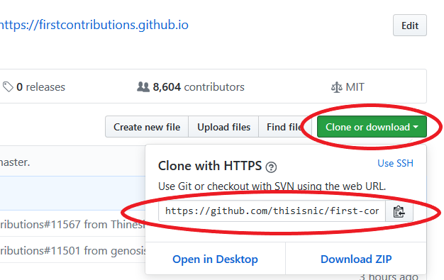
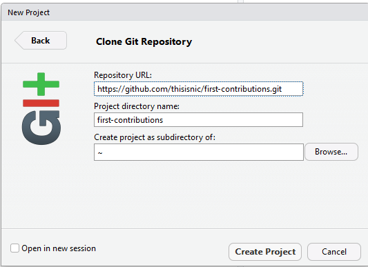
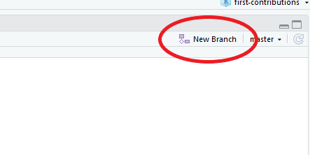
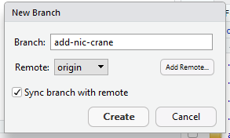
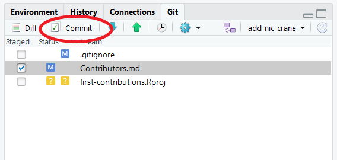
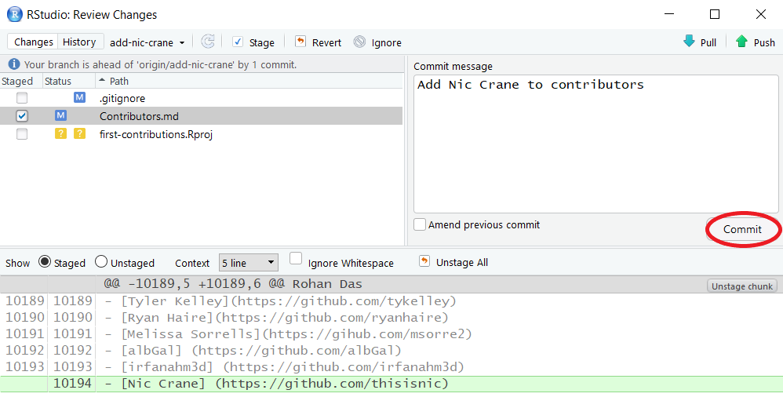
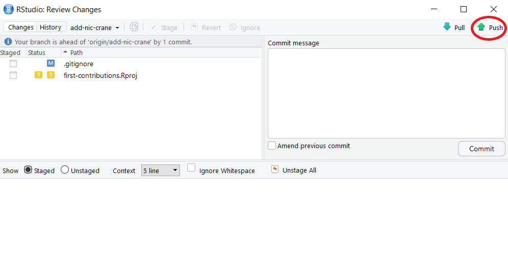
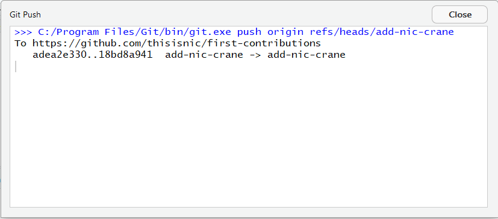

# First Contributions

||RStudio Edition|
|---|---|

It's hard. It's always hard, when you do something for the first time. Especially when you are collaborating, making mistakes isn't a comfortable thing. But open source is all about collaboration & working together. We wanted to simplify the way new open-source contributors learn & contribute for the first time.

Reading articles & watching tutorials can help, but what comes better than actually doing the stuff without messing up anything. This project aims at providing guidance & simplifying the way rookies make their first contribution. Remember the more relaxed you are the better you learn. If you are looking for making your first contribution just follow the simple steps below. We promise you, it will be fun.

## RStudio

Before you get started, you should make sure that you have [git](https://git-scm.com/downloads) installed and your identity configured by running the 
[relevant commands](https://git-scm.com/book/en/v2/Getting-Started-First-Time-Git-Setup#_your_identity) using Git BASH or other command line tool of your choice.

Download [RStudio](https://www.rstudio.com/products/rstudio/download/#download), install and open it.

## Fork this repository

Fork this repo by clicking on the fork button on the top of this page.

 

This will create of copy of this repository in your account and you will be redirected to this version of the repo.

You now need to get the URL for your repo.  Click "Clone or download" and copy the URL in the box.

 

## Create a new project

In RStudio, go to File -> New Project

Select "Version Control" and then "Git".

In the New Project dialog, paste the URL you copied from GitHub into the "Repository URL" box.

Choose the name you want the directory on your computer to be called, and put it in the "Project directory name" box.  By default, this is the name of the repo.

Finally, choose where you want the cloned repo to be stored by clicking the "Browse" button.

Once you have finished, click "Create Project" to clone the repo and set up the project.

 

The repo will now be cloned into whichever folder you specified.

## Create a branch

Click the new branch button.

 

Name your branch "add-your-name", for example: "add-nic-crane"

 

Make sure that "Sync branch with remote" is checked and click "Create".  You may be asked to enter your GitHub username and password.

## Make necessary changes and commit those changes

Now open the `Contributors.md` file in RStudio and add your name to it, then save the file.

You will see that the file has an 'M' next to it.  Check the box next to it and then click "Commit".

 

You'll see a diff file showing the changes you've made to the file.  Add a commit message - a summary of changes you've made, and then click "Commit".

 

## Push changes to GitHub

Congratulations, you've committed all the changes to your local copy of your branch of your fork of first-contributions.  Now click "Push" to sync your commit to the remote repo.

 

You'll see a box like this if your changes have been pushed successfully.  Click "Close".

 

## Submit your changes for review

If you go to your repository on github, you'll see  `Compare & pull request` button. Click on that button.

Now submit the pull request.

Soon I'll be merging all your changes into the master branch of this project. You will get a notification email once the changes have been merged.

## Where to go from here?

Congrats!  You have just completed the standard _fork -> clone -> edit -> PR_ workflow that you'll encounter often as a contributor!

Celebrate your contribution and share it with your friends and followers by going to [web app](https://roshanjossey.github.io/first-contributions/#social-share).

You could join our slack team in case you need any help or have any questions. [Join slack team](https://join.slack.com/t/firstcontributors/shared_invite/enQtMzE1MTYwNzI3ODQ0LTZiMDA2OGI2NTYyNjM1MTFiNTc4YTRhZTg4OWZjMzA0ZWZmY2UxYzVkMzI1ZmVmOWI4ODdkZWQwNTM2NDVmNjY).

Now let's get you started with contributing to other projects. We've compiled a list of projects with easy issues you can get started on. Check out [the list of projects in web app](https://roshanjossey.github.io/first-contributions/#project-list).

### [Additional material](additional-material/git_workflow_senarios/additional-material.md)

## Tutorials Using Other Tools

|||||
|---|---|---|---|
|[Command Line](README.md)|[GitHub Desktop](github-desktop-tutorial.md)|[Visual Studio 2017](github-windows-vs2017-tutorial.md)|[Visual Studio Code](github-windows-vs-code-tutorial.md)|

## Self-Promotion

If you liked this project, star it on [GitHub](https://github.com/Roshanjossey/first-contributions).
If you're feeling especially charitable, follow [Roshan](https://roshanjossey.github.io/) on
[Twitter](https://twitter.com/sudo__bangbang) and
[GitHub](https://github.com/roshanjossey).

